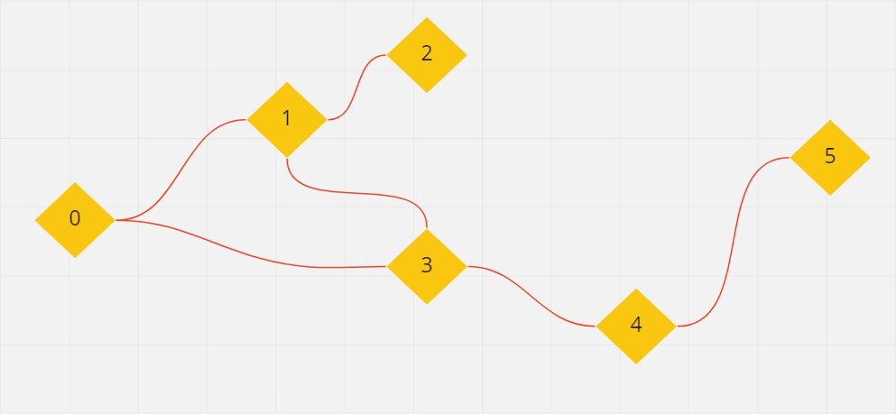
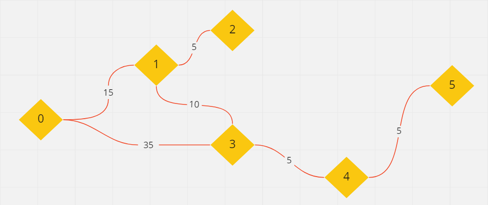
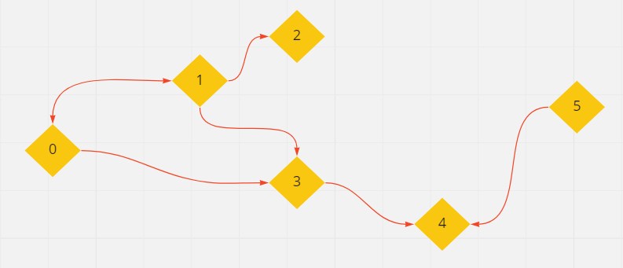

# C# BASIC

## 선형 자료 구조
`1 대 1 형태로 data를 순차적으로 나열한 형태`
- 배열 (Array)
- 동적 배열 (Dynamic Array)
- 연결 리스트 (Linked List)

## 비선형 자료 구조
`1 대 다 구조로 하나의 data 뒤에 다수의 data가 올 수 있는 형태 `
- 트리 (Tree)
- 그래프 (Graph)
  

### 그래프의 종류
---
- 단순 그래프 
  - 소셜 네트워크 또는 인맥 관계도 등에 사용된다

- 가중치 그래프 (weighted graph)
  - 간선에 비용이나 가중치가 추가된 그래프, `네트워크` 라고도 불린다.
  - 지하철 노선도, 통신망의 사용료 등에 사용된다.

- 방향 그래프 (directed graph)
  - 간선에 방향성이 존재하는 그래프
  - 일방 통행이 포함된 도로망, 사람간의 호감도 표현 등에 사용된다.

### 그래프의 탐색
- 깊이 우선 탐색 (DFS) 
- 넓이 우선 탐색 (BFS)
- 다익스트라 (Dijikstra)